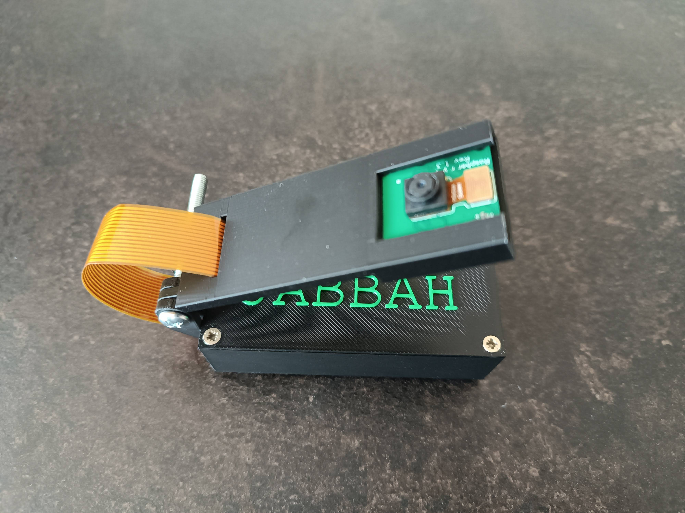

# RPi Camera

This is the documentation of RPi Camera, an application for MJPEG streaming a Raspberry Pi camera controllable with MQTT!

The following steps describe the installation of RPi Camera on Raspberry Pi.

## Hardware build

The door sensor consists of a Raspberry Pi Zero W (Raspberry Pi Zero 2 W) micro computer and a Raspberry Pi Camera module v 1.3 (a 15cm cable needed). The repository includes a printable 3D model (`.stl` file) of the case. To mount the PCB to the case, you need 4 2.5×10mm screws. To assembly the case, you need 4 2.5×10mm screws, 1 M4×30mm metric screw and 1 M4 nut. To prevent slipping, glue 4 anti-slip stickers to the bottom of the case. Use a 5V/1.2A power adapter (Micro-USB).

Below, you can see an example of the built hardware (**Note:** The text on the case is not a part of the `.stl` file included in this repository):





## Install the prerequisite software

**Note:** Python 3 and Picamera2 are automatically pre-installed on Raspberry Pi OS

### Install paho-mqtt

1. Connect to the device through SSH.
2. Switch to `root` through `sudo su`.
3. Install `python3-paho-mqtt` and `python3-picamera2`:
```
apt install python3-paho-mqtt python3-picamera2
```

## Install the app

### Prepare the UNIX user

1. Connect to the device through SSH.
2. Switch to `root` through `sudo su`.
3. Create the new user `rpicamera`:
```
adduser rpicamera
```
4. Add user `rpicamera` to group `video`:
```
usermod -a -G video rpicamera
```

### Prepare the file system

1. Create the `/var/rpicamera` directory:
```
mkdir /var/rpicamera
chown rpicamera:rpicamera /var/rpicamera
```
2. Copy the content of this folder to the directory `/var/rpicamera`.

### Customize `rpicamera.service`

1. Depending on the configuration of MQTT broker, set `APP_MQTT_USE_SECURE_CONNECTION` to `false` or `true`. In case of `true`, it's necessary to put the certificate files into the directory `/var/rpicamera` and don't forget to set their filenames into `rpicamera.service`:
```
APP_MQTT_CA_FILENAME=rootCA.crt
APP_MQTT_CERT_FILENAME=mysite.crt
APP_MQTT_KEY_FILENAME=mysite.key
```
2. Set the MQTT broker password encoded in base64.

### Start the app

1. Enable and start the `rpicamera` service:
```
systemctl enable /var/rpicamera/rpicamera.service
systemctl start rpicamera
```

### Usage

After the connection to the MQTT server, the RPi Camera sends its state every 15 seconds and after the state change using the `rpicamera-topic/state` topic.

The device state contains the following data:
- `on` (boolean)
- `timestamp` (Unix time in seconds)

You can set the stream on or off using the `rpicamera-topic/on` topic and the payload `{"value": true/false}`.

The MJPEG stream is accessible only on localhost by default (http:\/\/localhost:<stream_port>/stream). To make it available outside of localhost, you need to allow the stream port using a firewall (e.g. `ufw`). You can also enforce the usage of HTTPS instead of HTTP or secure the stream by some authentication method using an Apache2 or an nginx proxy.

## Authors

- [**Eli Nucknack**](mailto:eli.nucknack@gmail.com)
